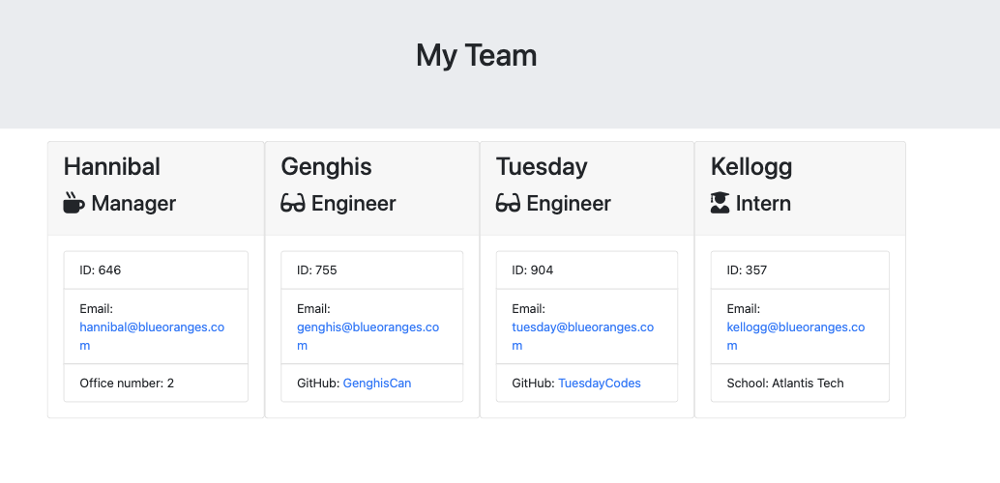

# Org-Chart-Generator

Node.js CLI app generating a webpage showing staff members of a fictional engineering team

# Module 12 challenge

Using starter code, create an app that generates prompts to gather data on a team of individuals and outputs the data to generate an html file. Roles that individuals in the team hold need to be generated from a general parent class of 'Employee' and each resulting class unit tested.

## Installation

Node.js should be installed in order to run the questions via the CLI in order to generate the chart. The most stable current version (LTS) can be downloaded from the Node.js website. Node Package Manager (npm) will be required in addition, to install dependencies, which in this case are Inquirer and Jest.

## Usage

https://github.com/SpecialFriendRice/Org-Chart-Generator

## Credits

Referred to own notes from course and Xpert Learning Assistant for syntax queries. Tutorial with TA Erik Hoversten clarified inexplicable issue with location of array declaration in code.

## License

MIT Licence, as outlined in the Github repository.
